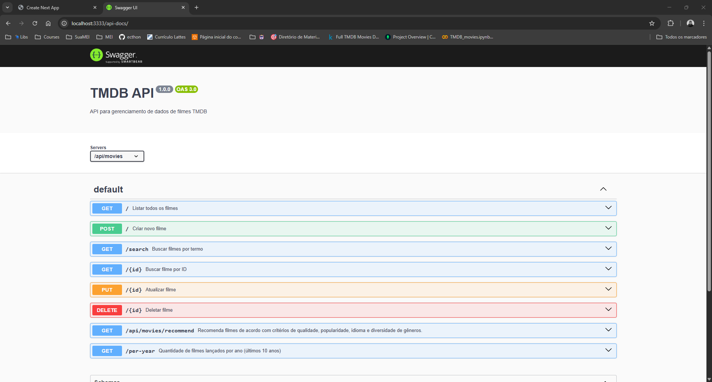

# TMDB API

API para gerenciamento de filmes.

---

## Resumo do Projeto

O projeto **TMDB API** é uma API desenvolvida em Node.js para o gerenciamento de filmes, utilizando banco de dados MongoDB. Ela permite cadastrar, buscar, atualizar, deletar e recomendar filmes, além de fornecer estatísticas sobre os filmes cadastrados. O projeto conta com documentação interativa via Swagger e pode ser executado tanto localmente quanto via Docker.

---

## Funcionalidades Principais

- **Listagem de Filmes:** Permite listar todos os filmes cadastrados, com suporte a paginação e filtros por título, status, ano e se é adulto ou não.
- **Busca de Filmes:** Possibilita buscar filmes por nome ou gênero, facilitando a localização de títulos específicos.
- **Recomendação de Filmes:** Gera uma lista de até 10 filmes recomendados com base em critérios de qualidade (nota e popularidade), status (lançados e não adultos), idioma (priorizando português e inglês), diversidade de gêneros e variedade. Os resultados são ordenados e embaralhados para garantir recomendações relevantes e variadas.
- **Detalhes de um Filme:** Permite buscar informações detalhadas de um filme específico a partir do seu ID.
- **Cadastro de Filmes:** Possibilita adicionar novos filmes ao banco de dados.
- **Atualização de Filmes:** Permite atualizar informações de um filme existente.
- **Remoção de Filmes:** Permite deletar um filme do banco de dados.
- **Estatísticas por Ano:** Fornece a quantidade de filmes lançados por ano.

---

## Pré-requisitos

- Node.js (versão X ou superior)
- npm

## Instalação

```bash
npm install
```

## Rodando o projeto

```bash
npm run dev
```

O servidor será iniciado na porta 3333.

## Configuração

1. Copie o arquivo `.env.example` para `.env` na raiz do projeto:
   ```bash
   cp .env.example .env
   ```
2. Preencha o arquivo `.env` com suas credenciais e configurações. Exemplo de variáveis necessárias:
   ```
   DATABASE_URL=
   MONGO_DATABASE=movies_db
   MONGO_COLLECTION=movies
   PORT=3333
   NODE_ENV=development
   ```
   - `DATABASE_URL`: URL de conexão com o banco de dados MongoDB.
   - `MONGO_DATABASE`: Nome do banco de dados.
   - `MONGO_COLLECTION`: Nome da coleção de filmes.
   - `PORT`: Porta em que a API será executada (padrão: 3333).
   - `NODE_ENV`: Ambiente de execução (ex: development, production).

3. Salve o arquivo `.env` antes de iniciar o projeto.

## Rodando com Docker

1. Certifique-se de ter um arquivo `.env` com a variável `DATABASE_URL` na raiz do projeto.
2. Para buildar a imagem Docker:

```bash
docker build -t tmdb-api .
```

3. Para rodar o container (certifique-se de que o .env está na raiz):

```bash
docker run --env-file .env -p 3333:3333 tmdb-api
```

A API estará disponível em http://localhost:3333

Se quiser customizar a porta, adicione a variável `PORT` no seu `.env` e ajuste o parâmetro `-p` do Docker. 

## Documentação Swagger

Acesse a documentação interativa em:  
http://localhost:3333/api-docs

A especificação OpenAPI está disponível no arquivo `swagger.json` na raiz do projeto.

<p align="center">
  
</p>

## Como funciona a recomendação de filmes

A lista de recomendações é gerada a partir dos seguintes critérios:

- **Qualidade:** Só são considerados filmes com nota (`vote_average`) igual ou superior a 6.0 e popularidade (`popularity`) igual ou superior a 10.
- **Status:** Apenas filmes já lançados (`status: "Released"`) e que não sejam adultos (`adult: false`).
- **Idioma:** Por padrão, são priorizados filmes em português (`pt`) e inglês (`en`). Se o parâmetro `language` for informado na URL, ele é priorizado junto com o inglês.
- **Diversidade de gêneros:** O sistema busca garantir que a lista final tenha variedade de gêneros, limitando a quantidade de filmes do mesmo gênero.
- **Ordenação e variedade:** Os filmes são ordenados por nota, popularidade e, em seguida, embaralhados para trazer variedade a cada requisição.
- **Limite:** São retornados até 10 filmes recomendados.

garantindo que a recomendação seja relevante, variada e adequada ao público.

## Exemplo de requisição

```bash
curl http://localhost:3333/api/movies
```